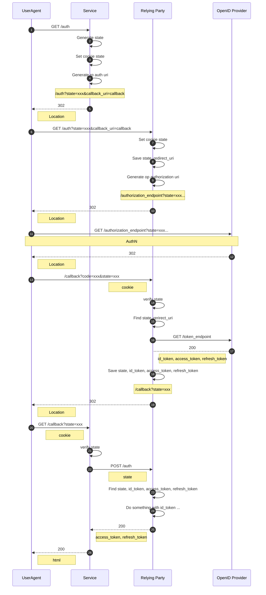

# sample-oidc-rp-platform

```mermaid
sequenceDiagram
autonumber

participant ua as UserAgent
participant sv as Service
participant rp as Relying Party
participant op as OpenID Provider

ua ->> sv: GET /auth
sv ->> sv: Generate state
sv ->> sv: Set cookie state
sv ->> sv: Generate rp auth uri
Note over sv: /auth?state=xxx&callback_uri=callback
sv -->> ua: 302
Note right of ua: Location
ua ->> rp: GET /auth?state=xxx&callback_uri=callback
rp ->> rp: Set cookie state
rp ->> rp: Save state, redirect_uri
rp ->> rp: Generate op authorization uri
Note over rp: /authorization_endpoint?state=xxx...
rp -->> ua: 302
Note right of ua: Location
ua ->> op: GET /authorization_endpoint?state=xxx...
Note over ua, op: AuthN
op -->> ua: 302
Note right of ua: Location
ua ->> rp: /callback?code=xxx&state=xxx
Note left of rp: cookie
rp ->> rp: verify state
rp ->> rp: Find state, rerirect_uri
rp ->> op: GET /token_endpoint
op --> rp: 200
Note right of rp: id_token, access_token, refresh_token
rp ->> rp: Save state, id_token, access_token, refresh_token
Note over rp: /callback?state=xxx
rp -->> ua: 302
Note right of ua: Location
ua ->> sv: GET /callback?state=xxx
Note left of sv: cookie
sv ->> sv: verify state
sv ->> rp: POST /auth
Note left of rp: state
rp ->> rp: Find state, id_token, access_token, refresh_token
rp ->> rp: Do something with id_token ... 
rp -->> sv: 200
Note right of sv: access_token, refresh_token
sv -->> ua: 200
Note right of ua: html
```
